# MAILSCAPE 1

### Contents of the module:-

1.Introduction to the project

2.Introduction to **Java** as an **Object Oriented Language**.

3.Brief overview of a **Full Stack Project**.

4.Installing **Java**.

5.Installing an **IDE**.

6.Creating a **Model Class** in Java.

---

### Introduction :

Hello there! Welcome to **MailScape**, a local Email Client which allows you to send, receive as well as star mail without the need to open your email again and again.

We shall cover every nook and cranny of this project over a period of 7 days, following which, there will be an innovation period, where you can put to the test what you have learnt.

This project is a prime example of a **Full Stack project**. We have two parts namely the Front-end and a Back-end, working hand in hand while connected to a Database.
Moreover, we shall learn a lot about **Object Oriented Programming** and its benefits in modern day programming.

---

### What is a Full Stack Project?

A full stack project is one which handles both the _Client_ and _Server_ side of a program.
For example, in a _Messenger_ app, the side which is only visible to us is the _Front-End_.
It consists of the UI, layout and the on-screen objects for client use.

On the other hand, when we try sending or receiving a message, there are a huge number of calls, server requests, responses sent in the background which we are unaware of. Even the login/authorization process is abstracted from the client . This side of an application is called the **Back-End**.

One more aspect, while using an application, we have some user data like email, phone etc, already stored once we log in. This is done by the use of a Database.
They are of two types: SQL and No SQL types.

The to and fro request and response between the three makes up a **Full Stack project**.
To find more, visit [here](https://www.geeksforgeeks.org/what-is-full-stack-development/).

---

### Installing Java

Now that we have a fair idea about it, let’s get started with the setup.

#### For Windows :

Download and install the latest jdk version from this [link](https://mail.codejava.net/java-se/download-and-install-java-11-openjdk-and-oracle-jdk).
Once downloaded, run the _installer_ and set the **PATH** variable in your device.

#### For Linux :

```

$ sudo apt update
$ sudo apt-get install openjdk-11-jdk
```

_Check your installation by running :_

```

$ java --version
```

---

### Installing an IDE:-

#### For Windows:

Download Java NetBeans IDE from this [link](https://netbeans.apache.org/download/index.html) and run the **installer** once complete.

#### For Linux:

> $ sudo snap install netbeans --classic

---

### Creating a Model Class in Java:-

Now that the setup is done, let us learn about some necessary classes.

#### What is a Model Class?

A **model class** is basically used to store user data and access it anytime in the program.
We use a _Constructor_ to initialize the current address of the variable. Whenever needed, we create an _object_ to access the required user details.

For Example let us look at the class created before:

This time we don't implicitly initialize the variables in the class.

```java
public class Mail {    // A class that stores two variables

String username,password;
public Mail(String a, String b) { //constructor to initialize
  this.username = a; this.password = b;
}
```

Now, to access the objects and functions of **Mail** from another class, we need an object of class _Mail_.

```java

Mail ob =  new Mail(“srjnmajumdar8@gmail.com”,”123456”); //object creation
String u = ob.username;  //accessing the function via object
String p = ob.password;
```

By this method, we can feed user data into a structure or a model and then access it later at will.

To know more about Java and it’s concepts, you may visit [here](https://www.javatpoint.com/java-tutorial).

That's it for this module. We will see you in the next module where we show how to connect to an SMTP Server and set up a Database for your application.

Until then,
**May The Source Be With You.**

---

---

# MAILSCAPE II

## Content of the Module:

1.How to create a project in NetBeans?
2.What is GUI?
3.What is Java Swing?
4.The Role of Java Swing in designing GUI.
5.Design a simple GUI using Java Swing and NetBeans GUI Builder.

---

## How to create a project in NetBeans?

Java development in the IDE takes place within projects, we first need to create a new project within which to store sources and other project files.

To create a new project application project:
1.Choose **File** > **New Project**. You can also click the New Project icon in the IDE toolbar.

2.In the **Categories** pane, select the **Java Ant** and in the **Projects** pane, choose **Java Application**. Click _Next_.

3.Enter _GUI_ (you can give any name,here it is GUI) in the Project Name field and specify the project location.

4.Ensure that the _Main Project_ checkbox is selected and name it as the _Main_ class.

5.Click **Finish**.

---

## What is GUI ?

The Graphical User Interface(GUI) is a form of user interface that allows users to interact with electronic devices through graphical icons, an audio indicator, video indicator, etc. GUI is used in computers, mobile devices, gaming devices, smartphones, and smaller household controls.

The actions in a GUI are usually performed through direct manipulation of the graphical elements with the help of pointing devices such as a mouse, trackball, stylus, or by finger on a touch screen.

---

## What is Java Swing ?

Java Swing is a lightweight Java graphical user interface (GUI) widget toolkit that includes a rich set of widgets. It is part of the **Java Foundation Classes (JFC)** and includes several packages for developing rich desktop applications in Java. The _javax.swing_ package provides classes for java swing API such as _JButton_, _JTextField_, _JTextArea_, _JRadioButton_, _JCheckbox_, _JMenu_, _JColorChooser_ etc.

---

## The Role of JAVA Swing in designing GUIs.

We have used the **NetBeans GUI builder**, which makes it easy to build complicated UI in **JAVA Swing**, by handling the code behind the placement of the components on screen in the background, while all we need to worry about is where to place a component and what functionality to add to it. This is not the best practice though, as experienced developers recommend writing out the code for the UI in plain and simple **JAVA**, but the learning curve can be steep for starters. So we will stick to the **NetBeans GUI Builder**.

In order to build a GUI using Java, it is essential to know the basics of what the GUI will comprise. The most fundamental part of building any GUI is to have a window for your application. To create a **window** in Java, you need to make use of the _JFrame_ class, which is present in the _javax.swing package_. The _javax.swing package_ contains many such classes that help in building UI elements, as you'll see as we explain further. Once a window has been created, a _JPanel_ is used to cover the entire area of the _window_. What this means is that the _JPanel_ serves as a container for the UI elements to be added, so we essentially add the _JPanel_ to the _JFrame_ using the add method(Not going further into implementation details, as this code generation will be automated). The other frequently used components provided by the _javax.swing package_ comprise _JLabel_, _JButton_, _JTextField_, _JList_, _JTable_ and many more. Most of these components have mnemonic names, so it is easier to understand what purpose they serve and we will be explaining the ones used by us.

---

## Design a simple GUI using Java Swing and NetBeans GUI Builder.

1.Selecting the project. Click on the _File_ and create a _New File_. The _Dialogue box_ appears. Select **Java Swing Forms** in _Categories_ and **JFrame Form** in _File_ types and click **Next**.

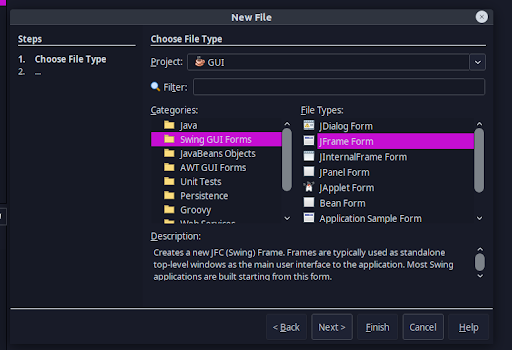

2.After Clicking **Next** you will be directed to the new dialogue box . Name **Class_Name** as _NewJFrame_ (as you wanted) and click **Finish**.

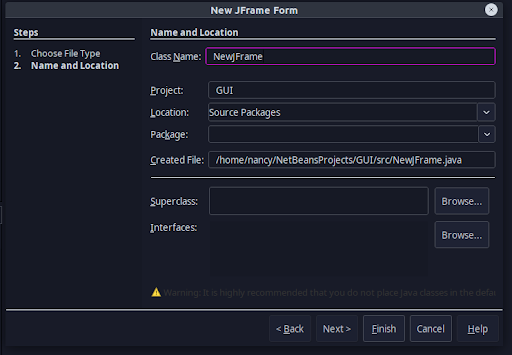

---

After the creation of the form, you will be presented with a screen as follows:

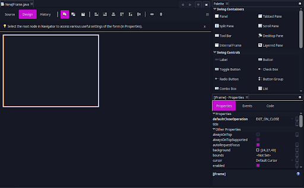

- The blank container to the left of the screen sn the **JFrame** form that you just created. This is the container that will hold a **JPanel**, which in turn will hold the other **UI elements**. At the top of this form you will see tabs named **Source** and **Design**, which refer to the source code and design of the form respectively. We are currently in the Design tab and you switch to the code by clicking on Source.

- Now we come to the most important part of the screen, the **Palette** which holds all the **Swing components**. The Palette is the box to the upper right portion of the screen. The components present here are sufficient to create a good looking GUI for our application.

- Below the Palette lies the **Properties** section, displaying the properties of the currently selected component. Properties include the _size_, _position_, _background color_, _foreground color_, _font_ and much more, that control the appearance of the component.

- Finally, the **Navigator** section on the bottom left corner of the screen shows the components that are part of the form.

---

The first component that you need after creating the **JFrame** is a container for your UI elements and as you guessed, it is the **JPanel**. The JPanel has properties very similar to that of the JFrame and it is the component that will specify the layout of the UI elements.

We will address the procedure to add other UI elements by building a very simple application that will have a **JTextField**, **JButton** and a **JLabel**. The user can type out something in the text field and on pressing the button, the typed text will be shown on the label. Using the following steps try to replicate what we make:

- From the _Palette_, click on the _JPanel_ component under _Swing Containers_ and place it anywhere on the _JFrame_ by just dropping it on the form.
  We can adjust the dimensions of _JPanel_ to the dimensions of the _JFrame_ by dragging the top left and bottom right corners of the _JPanel_ and placing it to match the _JFrame_ dimensions.

- Now, add a _JLabel_ from the _Palette_ to the _JPanel_. Adjust its size by dragging or from a **PROPERTY** section .
  Right clicking on the label from the _Navigator_ pane will provide options for renaming the variable and changing the text content of the label. We rename it as _JLabel1_ and text content as _Title_.

- Similar to the _JLabel_, add a _JTextField_ to the panel just below the label, giving it the same dimensions as that of the label and clear the text content. Then rename the text field to _tfTitle_.

- Add a _JButton_ from the _Palette_ and drop it to the bottom - center of _JPanel_. We rename the button variable name to _btnOK_ and change the text content to _OK_. At this point your JFrame form should look something like this:

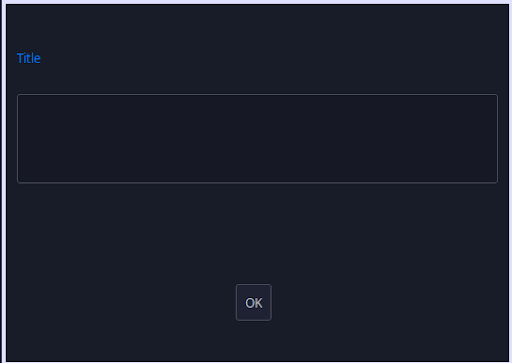

Now , we want to add functionality to the button as when button is pressed the title will be displayed of what is written inside _JTextField_ . We can add all kinds of different **Event Listeners** to a component but here we require the **actionPerformed** event. To do this right-click on the button from the **Navigation** pane and hover over the **Events** option. From the dropdown menu go to **Action** followed by **actionPerformed** and _click_ on it. This should take you directly to a function on the **Source** tab of the _JFrame_ form.

The empty function will be shown and we add two lines of code inside it.

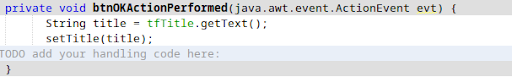

- **getText()** is used to get the value written inside _JTextField_ and it is stored in the variable _title_.

- **setTitle()** will display the text in the **TITLE** of our small project.

Now that you are done, just click on the _green colored arrow button_ (Run Button) on the **Toolbar** at the top of the IDE to run your simple GUI application. You should see a window popping on the top left corner of your screen. You will see this:

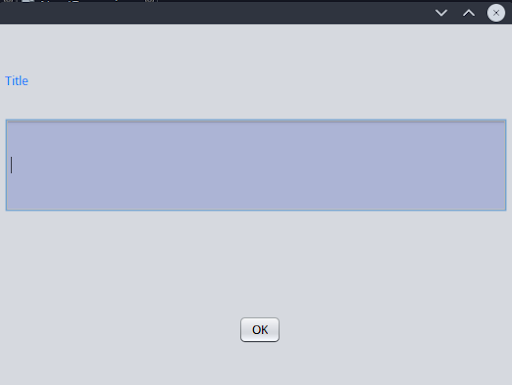

Type in a sample text and click on the button. It should look something like this:

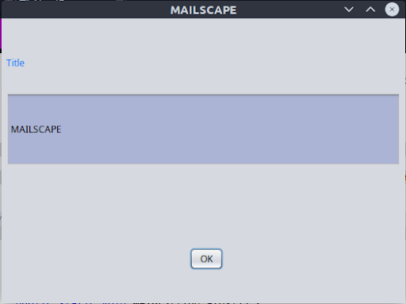

Thus, you should now have a rough idea as to how you can add components to a form. You can modify it and add more components and features to it.

That's it for today, in the next module we shall proceed to the setup and requirements of the project.

Until then,
**May the Source be with you!**

---

---

# MailScape - III

## Contents of the Module:-

1. Introduction APIs and JavaMail API
2. Introduction and Setup to SMTP Server, Protocols
3. Introduction to Database
4. Installing MySQL
5. Some basic MySQL commands

## What is an API?

API is the acronym for Application Programming Interface, which is a software intermediary that allows two applications to talk to each other. Each time you use an app like Facebook, send an instant message, or check the Weather on your phone, you’re using an API.

For our use, we can say that an API helps us deliver a request to the provider and brings back the response to us, much like an intermediary messenger!

## JavaMail API:-

The JavaMail API provides a platform-independent and protocol-independent framework to build mail and messaging applications. It supports various protocols like **SMTP, POP3, IMAP**, etc. It provides us with various facilities and formats to build our mail. If you want to read the JavaMail API documentation, click [here](https://javaee.github.io/javamail/docs/api/).

Speaking of protocols, which protocols are we going to use?

We are going to use the **SMTP** server and **IMAP** store, with **TLS** security protocol. Seems a bit confusing right? Well, worry not !

**What is an SMTP Server?**

SMTP( Simple Mail Transfer Protocol) is basically an email equivalent to an HTTP server for Web pages. It serves as a means for processing data to and from the user. In this project, we will be using Gmail’s SMTP Server.

**What is the use of TLS in our Project?**

It stands for Transport Layer Security, which is a successor protocol to SSL. It provides authentication, privacy, and data integrity between two communicating computer applications. It usually works on the default mail submission port 587. We shall be using this in our project.

**What is IMAP?**

Internet Message Access Protocol is a standard email protocol that stores email messages on a mail server. Basically it is used by email clients to retrieve emails from Gmail’s IMAP Server. It usually works on the default mail retrieval port 993.

Now that you’re on board, let’s proceed with the setup.

## Connecting to an SMTP Server:-

We are going to connect our application to Gmail's SMTP server. You may download any SMTP Server like Postcast server, Apache James server

1. Go to your Google Account and select the Security option.
2. Go to the 2-Step Verification option and turn it on.

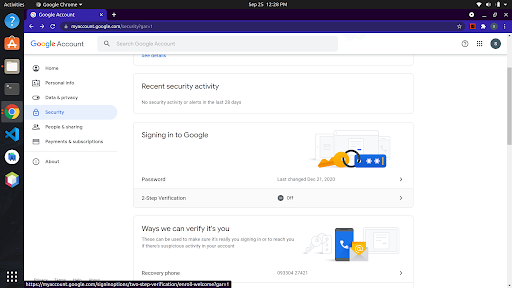

3. Now under **Signing in to Google**, select **App Passwords** , select app type as custom and provide a name and click **Generate**.
4. An app password will be generated. Note it down. We shall require this in future.

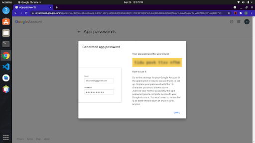

## Introduction to Database:-

A database is an organized collection of structured information, or data. Based on the structure on which data is stored, it is divided into mainly two types:-

i). **SQL Database**
ii). **No SQL Database**

Another type of database that stores and provides access to data points that are related to one another, called **Relational Database**.

**SQL Database** has a predefined schema for the structure of our data. It stores in a tabular format and is vertically scalable. Eg:- **MySQL, PostgreSQL**

**No SQL Database** has dynamic schemas and storage is key-value-based. It is horizontally scalable. Eg:- **MongoDb, Firebase**

For our project, we are going to use **MySQL Relational Database**.

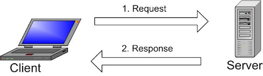

Various client programs such as **MySQL** tools for database administration or any applications that are written in other programming languages, can connect to the server and make database requests. The server processes client requests and returns the results back to the client.

## Installing MySQL:-

**For Linux:**

```
$ sudo apt install mysql-server
```

After installation, complete the secure installation for password setup.

```
$ sudo mysql_secure_installation
```

Set up a password and you may select yes (Y) in the successive queries. After the setup is complete you will have a user “root” with your desired password. You are advised to create a new user for this project.
Log in to the MySQL interface:

```
$ sudo mysql -u root -p
```

Most probably will ask for your sudo password for your device.

Once logged in, you will see a welcome message. Now, create a new user by:

```
mysql> CREATE USER 'your_username'@'localhost' IDENTIFIED BY 'your_password';
mysql> GRANT ALL PRIVILEGES ON *.* TO 'your_username'@'localhost';
mysql> UPDATE user SET plugin='auth_socket' WHERE User='your_username’;
mysql> FLUSH PRIVILEGES;
mysql> exit;
```

```
$ sudo service mysql restart
```

```
$ mysql -u your_username -p
```

Now login with your set password.

```
ALTER USER 'your_username'@'localhost' IDENTIFIED WITH mysql_native_password BY 'password';
```

Now, run

```
SELECT User, Host, plugin FROM mysql.user;
```

This shows your username with the plugin as **mysql_native_password.**

**For Windows:**

Download the mysql installer from [here](https://dev.mysql.com/downloads/installer/)

For setup type, select **Full**. Inside the setup you can setup your root password or add a new user and configure it’s password.

For more visit: [https://www.youtube.com/watch?v=GIRcpjg-3Eg](https://www.youtube.com/watch?v=GIRcpjg-3Eg)

Open MySQL Command Client and enter your password. Once the server starts, it will show a welcome message! Rest of the mysql> commands are the same as stated earlier.

## Some Basic MySQL Commands:-

In order to connect from our project to the mysql server, you need to download a suitable version of a .jar file **mysqlconnector.jar** and add it to the CLASSPATH of your project. We will require this while connecting our project to our MySQL server.

Download the latest version (8.0.26) from [here](https://jar-download.com/artifacts/mysql/mysql-connector-java)

To Create a Database:-

```
mysql> CREATE DATABASE Database_name;
```

To Use a Database:-

```
mysql> USE Database_name;
```

Once inside, create a table :

```
mysql> CREATE TABLE TableName(var1 TEXT, var2 TEXT);
```

To view the list of tables :-

```
mysql> SHOW TABLES;
```

Display a particular Table :-

```
mysql> SELECT * FROM TableName;
```

To know more, read the Documentation [here](https://dev.mysql.com/doc/refman/8.0/en/create-database.html)

That’s it for this module. See you at the next module where we go deep into the functionalities of our project. Until then, **May the source be with you!**

---

---

# MailScape - IV

## Contents of the Module:-

1. Project Architecture
2. Sending a Mail
3. Sending Attachment
4. Receiving Mail
5. Starring an Email

## Project Architecture:-

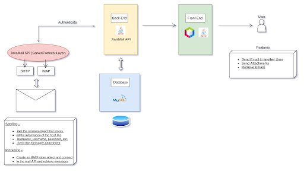

The Front-end portion is primely Java Swing. The Back-end is divided into two parts:-
The SMTP and IMAP Server and the MySQL Database.

Now that we have a visual idea of our project, let us get into its details.

## Sending a Mail:-

1. Get the **session object** that stores all the information of the host like name, username, password, protocol type and port number.
2. Compose the Message.
3. Send the message.

If you are using **Java**, you will require two **.jar** files, download them and add them to the CLASSPATH:

- mail.jar
- activation.jar

  Download a suitable version of both:

  i). [mail.jar](https://jar-download.com/artifacts/com.sun.mail/javax.mail)
  ii). [activation.jar](https://jar-download.com/?search_box=javax.activation)

→ To create a session object, for example JavaMail API has a **javax.mail.Session class** provides two methods to get the object of session, Session.getDefaultInstance() method and Session.getInstance() method. You can use any method to get the session object. It takes in a **Properties()** object.

Before passing the properties object, we set various attributes to the Properties() object, like **host, protocol type, and port number**.

→To create a message, we create a Message or a MimeMessage object. In **Java** javax.mail.Message provides such a class.

**MIME**(Multipurpose Internet Mail Extensions) is an Internet standard that extends the format of email messages to support text in character sets other than ASCII, as well as attachments of audio, video, images, and application programs.

_In short, we pass the session object to the Message or MimeMessage object._

Next we populate the **sender, recipient, subject** and **body** of the Message object and send it.

_Note that if you are using **TLS** protocol, the port no. should be **587** and for **SSL**, it should be 465._

The username and password for authentication should be your **email** and respective **App** password set earlier.

\***\*If you are using Java and TLS, make sure to look into java.security in the jdk folder.**

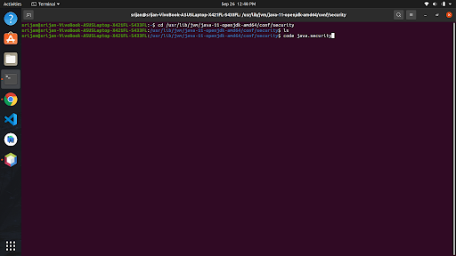

Open the java.security folder.
Remove two entries of **TLS** from the searched line given below:

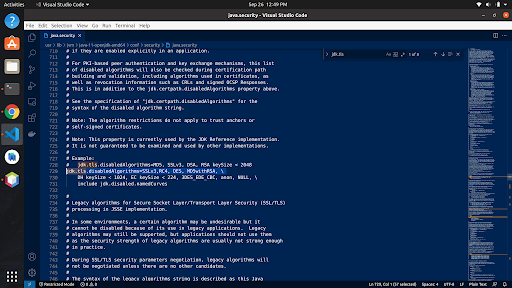

From here on, it should be good to go !!

## Sending an Attachment:-

To send an attachment, we select a file from our local storage and save it’s **absolute** path. After passing the path to a File object, we get the selected file.

To send an attachment in a mail, we can not have a normal Message object. We must have the body as a MimeMultipart object. In that multipart, we add the chosen file and send the mail.

## Receiving a Mail:-

1. Get the **session** object as stated before.
2. Create an IMAP store object and connect with the **IMAP** server.
3. Create a folder object and open it.
4. Retrieve mail from that folder as a Message array.
5. Close the folder.

This time, in the **Properties** object, we set the connection to the **IMAP** server at port **993**.
After we connect to the Imap Store with authentication, we create a **Folder** object to get the desired folder from the store.

These are the default folders:-

- INBOX
- Personal
- Receipts
- Travel
- Work
- [Gmail]

To access the ‘All Mail’ folder, the path name is put while connecting to the store as **“[Gmail]/All Mail”**

The Store returns an array of messages of type **Messages.** Traverse through the array objects and extract the subject and body from the MimeMultipart Message.

## Starring an Email:-

If you are using MySQL, we will require a table schemed storage.

Create a table of three columns to store the sender address, subject and body of the mail.
Now from our project we need to connect to our MySQL Server.

```
Connection con=DriverManager.getConnection(StringConstants.DB_URL,
StringConstants.USER,StringConstants.PASS);
```

Next, we execute queries to select a particular named table and insert into it our desired values, using the **INSERT INTO** query.

Here’s a snippet for understanding,

```
String sqlInsert = "INSERT INTO Star (name,sub,body)" + "VALUES ('"+ fro+"', '"+sub+"', '"+body+"')";
int countInserted = stmt.executeUpdate(sqlInsert);
```

Here, _name, sub, and body_ are **Strings**, thus we surround them by ‘ ‘ single quotes.
_Star_ is the name of the table.

_stmt_ is a **Statement** object which is an interface and it is used to send a SQL query to the database.

```
Statement stmt = con.createStatement();
```

For fetching values, we run through a similar process.

After connection, we run a **SELECT \* FROM** query to get all the contents of a table.

That pretty much wraps up the contents of this project. If you have gone through every step, you should have a pretty much up and running Email Client for yourself. Until next time, **May the Source be with you!**
